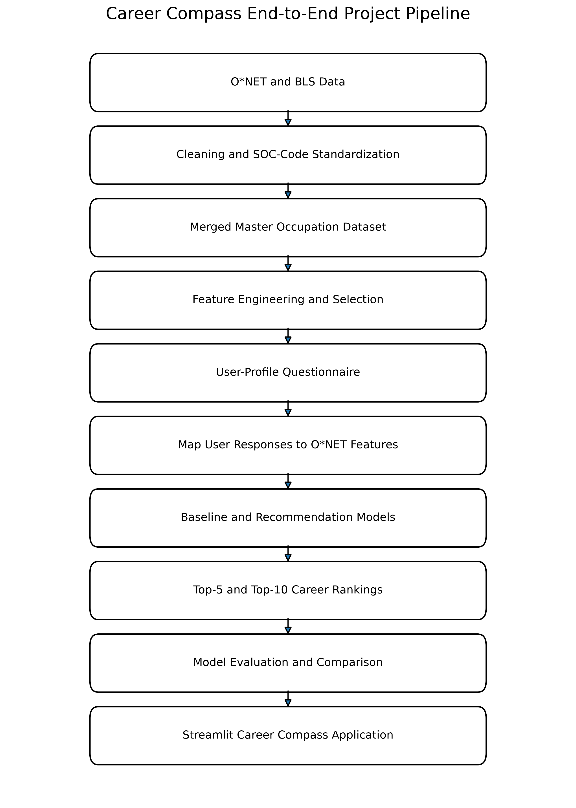

# Career Compass
### Data-Driven Career Recommendation System

Career Compass is an end-to-end data science application that recommends occupations based on a user's interests, skills, education, and career preferences. The system integrates occupational characteristics from **O*NET 30.3** with **BLS Occupational Employment and Wage Statistics (OEWS)** to provide personalized, data-driven career recommendations.

Rather than treating career selection as a traditional classification problem with a single "correct" answer, Career Compass approaches career recommendation as a **similarity-matching and ranking problem**, identifying occupations that best align with each user's individual profile.

## Project Highlights

- Integrated O*NET and BLS OEWS data into a unified dataset containing **1,016 occupations and 408 features**
- Achieved a **94.6% O*NET-to-BLS occupational match rate**
- Engineered features representing interests, skills, education, job zone, wages, and labor-market characteristics
- Developed and compared **Baseline, Weighted Compatibility, Cosine Similarity, and K-Nearest Neighbors (KNN)** recommendation approaches
- Evaluated KNN using **Euclidean, Manhattan, Minkowski, and Cosine distance metrics**
- Evaluated recommendation quality using **Precision@K, Recall@K, Hit Rate, Mean Reciprocal Rank (MRR), NDCG@10, and catalog coverage**
- Developed an interactive **Streamlit application** for user-driven career recommendations

## Recommendation System

Career Compass compares a user's questionnaire responses against occupational characteristics and ranks careers according to compatibility.

Four recommendation approaches were developed:

1. **Baseline Model** — ranks occupations using wage and employment opportunity
2. **Weighted Compatibility** — combines interests, skills, education, job-zone, and labor-market factors using interpretable weights
3. **Cosine Similarity** — ranks occupations according to similarity between user and occupation feature vectors
4. **K-Nearest Neighbors (KNN)** — identifies similar occupations using Euclidean, Manhattan, Minkowski, and Cosine distance metrics



## Model Evaluation

Recommendation models were evaluated against hand-curated relevant occupations for test user profiles using:

- Precision@5 and Precision@10
- Recall@5 and Recall@10
- Hit Rate@5 and Hit Rate@10
- Mean Reciprocal Rank (MRR)
- NDCG@10
- Catalog Coverage

Among the evaluated configurations, **KNN using Minkowski distance (p=3)** produced the strongest overall performance on **NDCG@10 and MRR**, while Cosine Similarity and KNN-Cosine were competitive on Precision and Recall.

The wage/employment baseline performed substantially worse across the evaluation metrics, demonstrating the value of incorporating user interests, skills, education, and occupational characteristics into career recommendations.

## Data Pipeline

The project combines two major U.S. labor-market data sources:

**O*NET 30.3**
- Occupational skills
- Knowledge areas
- Interests
- Abilities
- Work activities
- Education and job-zone characteristics

**BLS OEWS — May 2025**
- Occupational employment
- Mean and percentile wages
- Labor-market statistics

The resulting master dataset contains **1,016 occupations across 408 features** and serves as the foundation for the recommendation system.

## Technologies

**Languages & Libraries:** Python, pandas, NumPy, scikit-learn  
**Machine Learning:** K-Nearest Neighbors, Cosine Similarity, Feature Scaling, Similarity-Based Ranking  
**Data Science:** Feature Engineering, EDA, Data Integration, Model Evaluation  
**Application:** Streamlit  
**Development:** Jupyter Notebook, Git, GitHub

## Repository Structure

```text
career-compass/
│
├── code/                     # Data preparation, EDA, and evaluation notebooks
├── data/                     # Processed datasets and data-quality outputs
├── other_material/           # Data dictionaries and supporting documentation
├── Person_1_Career_Compass/  # Recommendation system and Streamlit application
│   ├── src/                  # Modeling and application modules
│   ├── data/                 # Application data
│   ├── outputs/              # Model results and evaluation outputs
│   ├── figures/              # Pipeline visualization
│   ├── app.py                # Streamlit application
│   └── requirements.txt
│
└── README.md
